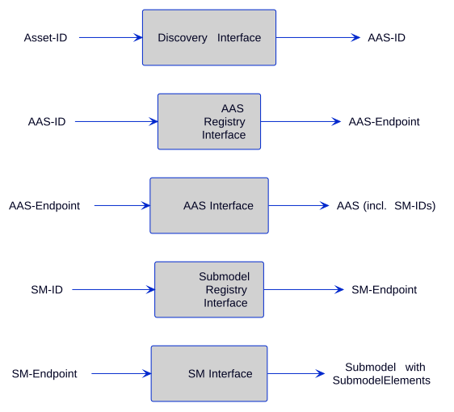

# Asset Administration Shell

- Two “kinds” of assets:
  - type asset (`Type`)
  - instance asset (`Instance`)
- [Intro from BaSyx](https://wiki.basyx.org/en/latest/content/concepts/basyx_concepts.html) concepts is relatively nice
  - Describes the different services of the AAS:
    - **Asset Administration Shell**:
      - Digital representation of asset
      - Identifies asset
      - Holds digital model of various aspects (submodel)
    - **AAS Submodules**:
      - Defines specific aspect of asset
      - Can become standardized → Submodel types
    - **Repository**:
      - Store the data of Asset Administration Shells, Submodels and Concept Descriptions
    - **Registry**:
      - Directories that store AAS-IDs and Submodel-IDS together with related endpoints (typically URL path into repository or to a single AAS/Submodel)
      - Enables registration and lookup of asset administration shells
      - Entities that provide an AAS may register
    - **Discovery**:
      - Additional service that uses registry to find AAS and submodels

## Specification

- [Metamodel](https://industrialdigitaltwin.io/aas-specifications/IDTA-01001/v3.2/index.html)

### Interesting Links

[Common Attributes](https://industrialdigitaltwin.io/aas-specifications/IDTA-01001/v3.2/spec-metamodel/common.html): Define the interfaces various classes implement

## Definition for Various Attributes

- [AssetInformation](https://aas-core-works.github.io/aas-core-meta/v3/AssetInformation.html)

## Asset Retrival

Source: {cite:p}`idta2026api`

## Tools

- [List from IDTA](https://industrialdigitaltwin.org/solutions-hub)

### AAS Manager

- [Homepage](https://github.com/rwth-iat/aas_manager)

### AAS (JSON/XML) to RDF (JSON-LD/Turtle)

- [Homepage](https://github.com/mhrimaz/py-aas-rdf)

### BaSyx

- [Homepage](https://basyx.org)
- [Open source](https://github.com/eclipse-basyx)
- AAS Environment:
  - AAS Discovery
  - AAS Registry
  - Submodel Registry
  - AAS Repository
  - Submodel Repository
  - Concept Description Repository
- BaSyx components:
  - **Control components**:
    - E.g. actuator, sensor
    - Do not decide when and if a specific service is called
  - **Group components**:
    - Higher level service
    - Uses control and other group components
    - Do not decide when and if a specific service is called
  - **Virtual automation bus (VAB)**
    - Maps five primitives (create/retrieve/update/delete/invoke) to network and protocols
  - **Device integration components**
    - VAB components
    - Realized on edge devices
    - Integrate non-Industrie 4.0 devices
  - **Gateway**
    - Bridge networks to enable inter-network communication
    - Needs to provide mapping of primitives to its supported protocol
  - **Process control**
  - **Monitoring**

### Bosch Semantic Stack

- Used for Battery Passport
- Four levels
  - Semantic Data Models Layer
  - Semantic Data Layer
  - Digital Twins and Data Products Layer
  - Solutions Layer
- Third level can be used to [manage digital twins](https://docs.bosch-semantic-stack.com/concepts/asset-administration-shell.html)
- Fourth layer provides support for DPP
